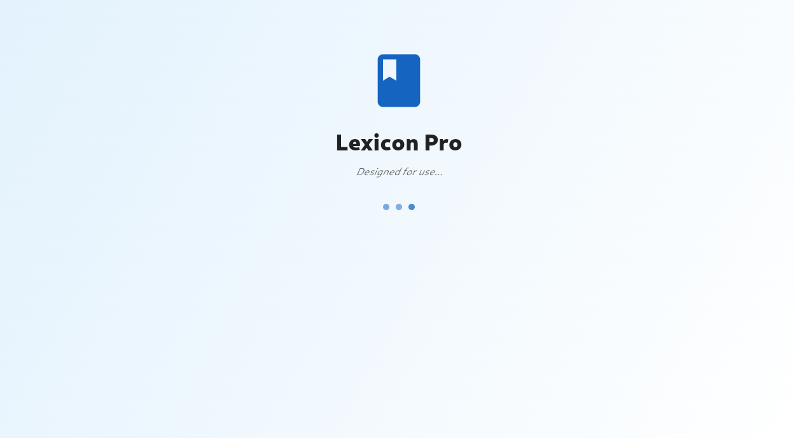
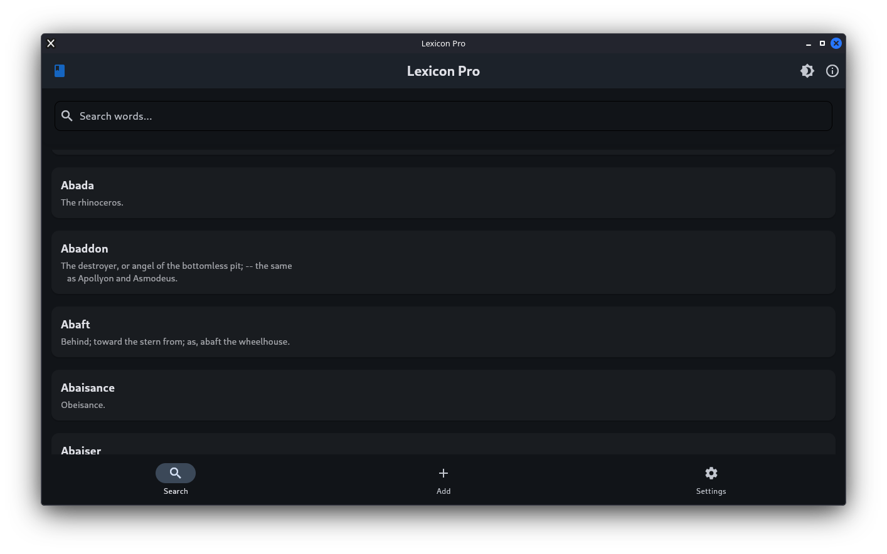
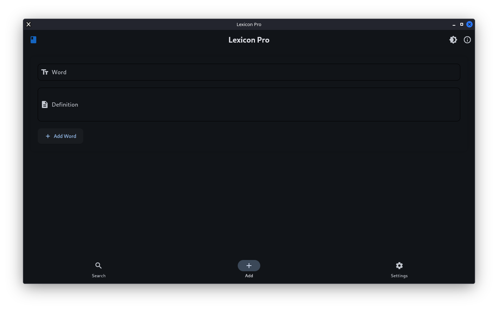
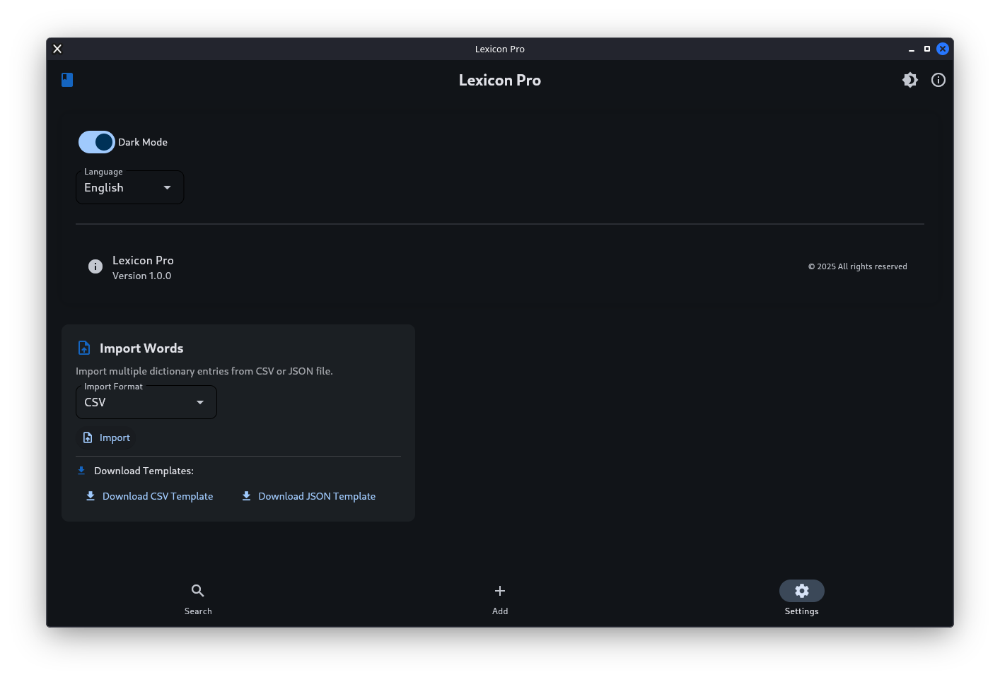

# Lexicon
Lexicon - Simple GUI for dictionary in python

## Features

- Search for words
- Add new words
- Remove words
- Update words
- Save dictionary to file
- Load dictionary from file
- Import dictionary from file
- Database secured by sqlcipher


## Installation


 Clone this repository or download the source code.
Install dependencies:
```bash
pip install -r req.in
```
Run the application:
```bash
flet run
```
or 
```bash
python main.py
   ```


## Build App


* Android 
```bash
flet build apk
```

    * Java (JDK) and Android SDK will be automatically installed on the first run of `flet build android` command.
    * JDK is installed into ` $HOME/java/{version}` directory.

    * If you have Android Studio installed Flet CLI will locate and use Android SDK coming with the studio; otherwise Android SDK will be installed to `$HOME/Android/sdk` directory.

    * Android NDK will be installed to `$HOME/Android/ndk/{version}` directory.


* Windows
  *   Building Flet for windows requires Visual Studio 2022 with Desktop development with C++ workload installed.
  * Enable Developer Mode 
  ```
  start ms-settings:developers
  ```
  * ``` flet build windows ```
  * If that command fails, try to pack via pyinstaller
  ```
  pyinstaller --onefile --noconsole ^
  --add-data "translations.py;." ^
  --add-data "database.py;." ^
  --add-data "storage;storage" ^
  --hidden-import "flet" ^
  --hidden-import "asyncio" ^
  --hidden-import "translations" ^
  --hidden-import "database" ^
  --hidden-import "flet.control" ^
  --hidden-import "flet.page" ^
  --hidden-import "sqlite3" ^
  --hidden-import "sqlcipher3.dbapi2" ^
  --hidden-import "sqlcipher3" ^
  --icon=logo.ico ^
  main.py
  ```

* Linux

  * ` flet build linux ` 

* Mac
  * For MacOS did not tested yet, if you want to test it, do yourself something fails open an issue. 

  ` flet build macos `

  * what other requirements to build you can see [here](https://flet.dev/docs/developing-apps/building-apps).

* Web
  * ` flet build web `


## Screenshots

### Splash Screen

*Animated splash screen displayed on application startup*

### Search Interface

*Real-time filtering and modern search experience*

### Add Word Feature

*Interface for adding new entries to the dictionary database*

### Settings

*Interface settings for adding new entries to the dictionary database and lang changer*
